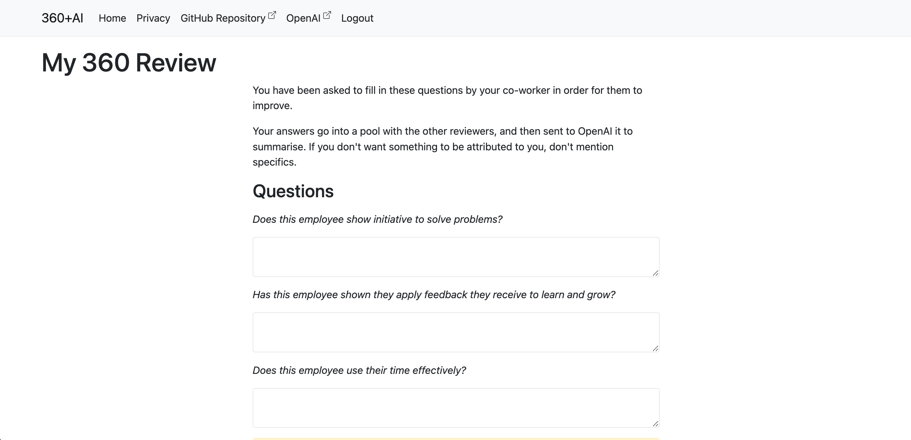

# 360+AI

Self-Service 360° reviews using OpenAI.

# Installation

Run on your own infrastructure.

    Production Docker image tbc

# Development Environment Setup

You need:
- VS Code
- [Remote Containers](https://marketplace.visualstudio.com/items?itemName=ms-vscode-remote.remote-containers) plugin installed
- Docker

Then open the repository in a VS Code Remote Container (you should be prompted to).

    # Set up secrets
    dotnet user-secrets set "OpenAIAPIKey" "(insert key - sign up at https://openai.com/api/ and get an API key)"

    # Set up certificate for Data Protection in DB with Entity Framework
    dotnet dev-certs https -ep "certificate.pfx"

    # Install .net tools
    dotnet tool restore

    # Install packages
    dotnet restore

    # Log into the DB

    pgAdmin:
    http://localhost:5556
    username: admin@360plus.ai
    password: admin

    connection:
    host: db
    username: postgres
    password: postgres

    # Make a db called
    threesixtyplusai

    # Set up the database from the Migrations
    dotnet ef database update

    # Optionally seed dev (see below)
    dotnet run -- -seed-dev

# Add/Edit Questions

Static Questions/Question catetories are in `SeedData\SeedQuestions.json` and are provisioned as part of the Entity Framework `OnModelCreating` process.

# FAQ

- All Error handling just redirects to the home page
- "Auth" is done with sessions
- There is a background process that is designed to delete old ThreeSixtyReviews

# Development Environment

## Seed Dev

You can run and re-run this to reset the dev seed data.

    # THIS WILL DESTROY ANY DATA CHANGES YOU HAVE MADE
    dotnet run -- -seed-dev

It generates a pre-filled 360 Review:

    AccessCode: E

## To run the application with Hot Reload

    dotnet watch

Visit localhost:5165

## To debug the application in Visual Studio Code

    (Press F5)

## Other handy commands for copy/paste

    # Regen from scratch (after deleting main schema in pgAdmin)
    rm -rf Migrations && dotnet ef migrations add InitialCreate && dotnet ef database update && dotnet run -- -seed-dev

    # Seed
    dotnet run -- -seed-dev

    # e.g. dotnet ef migrations add InitialCreate
    dotnet ef migrations add 

# Disclaimer

THE SOFTWARE IS PROVIDED "AS IS", WITHOUT WARRANTY OF ANY KIND, EXPRESS OR IMPLIED, INCLUDING BUT NOT LIMITED TO THE WARRANTIES OF MERCHANTABILITY, FITNESS FOR A PARTICULAR PURPOSE AND NONINFRINGEMENT. IN NO EVENT SHALL THE AUTHORS OR COPYRIGHT HOLDERS BE LIABLE FOR ANY CLAIM, DAMAGES OR OTHER LIABILITY, WHETHER IN AN ACTION OF CONTRACT, TORT OR OTHERWISE, ARISING FROM, OUT OF OR IN CONNECTION WITH THE SOFTWARE OR THE USE OR OTHER DEALINGS IN THE SOFTWARE.
